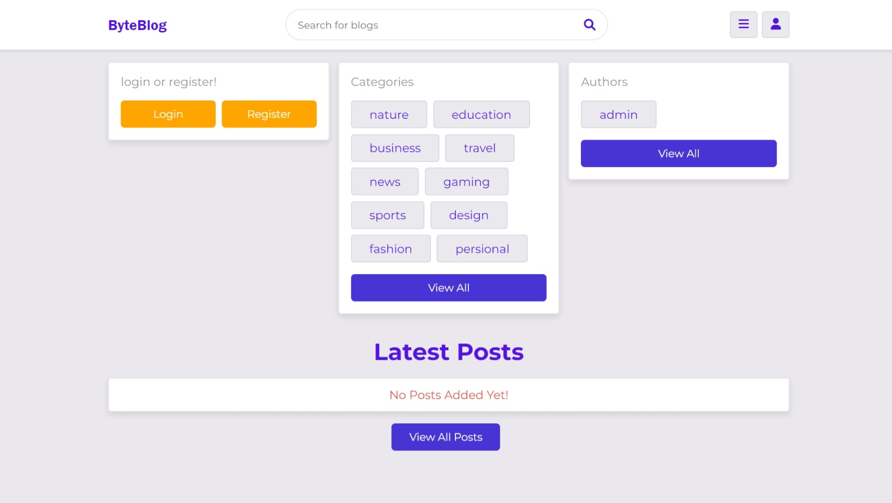
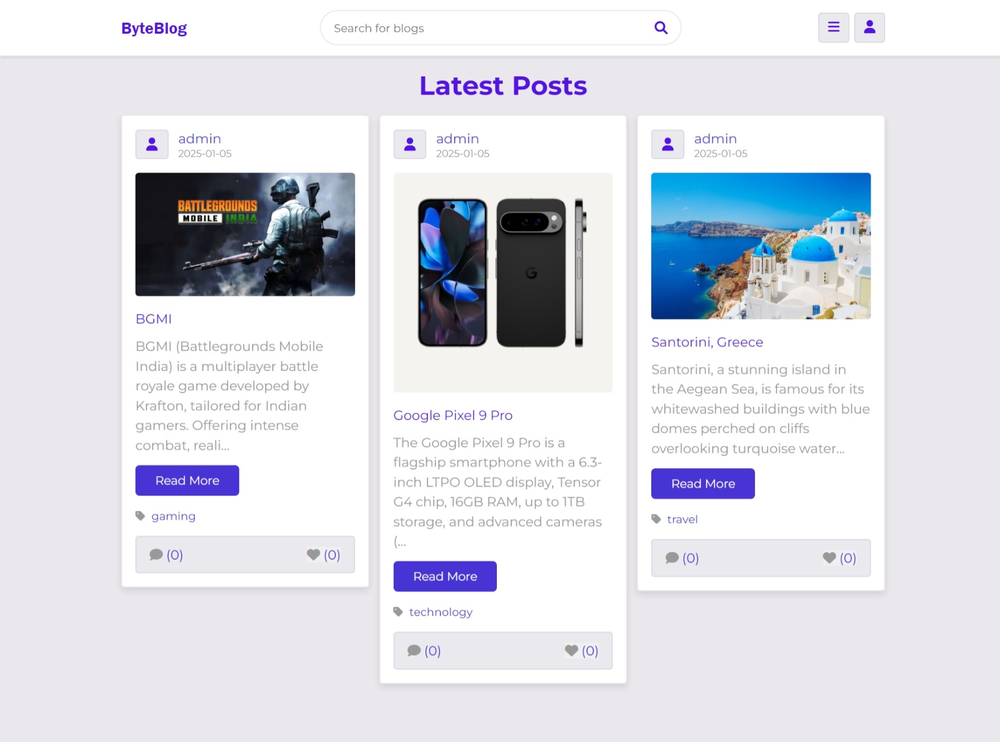
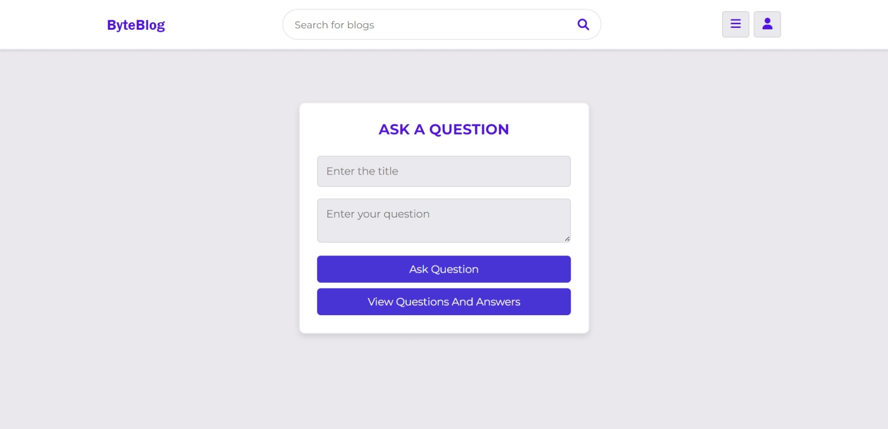

# ByteBlog - Blogging and Q&A Platform

ByteBlog is a dynamic blogging platform integrated with a Quora-like question and answer functionality. It allows users to create, share, and interact with content on a variety of topics, ranging from education and technology to personal stories and more. The platform is built with PHP and MySQL, designed to be hosted locally using XAMPP or similar environments.

## Features

- **User Authentication**: Secure registration and login system.
- **Blog Creation**: Users can create, edit, and delete their own blog posts.
- **Categories**: Posts can be organized by categories for easy navigation.
- **Interactive Comments**: Users can comment on posts and engage in discussions.
- **Likes System**: Support for liking posts to show appreciation.
- **Quora-like Q&A**: Ask questions and provide answers to community queries.
- **Responsive Design**: Mobile-friendly and accessible on all devices.
- **Admin Dashboard**: Manage users, posts, and site content efficiently.

## Technologies Used

- **Frontend**: HTML, CSS, JavaScript, Bootstrap
- **Backend**: PHP
- **Database**: MySQL
- **Hosting**: Locally hosted using XAMPP

## Installation

1. Clone the repository:
   ```bash
   git clone https://github.com/yourusername/ByteBlog.git
   ```
2. Move the project folder to the XAMPP `htdocs` directory.
3. Import the database:
   - Open `phpMyAdmin` and create a new database (e.g., `blog_db`).
   - Import the SQL file included in the project (`blog_db.sql`).
4. Configure the database connection:
   - Open `components/connect.php`.
   - Update the following variables as needed:
     ```php
     $db_name = 'blog_db';
     $db_user = 'root';
     $db_pass = '';
     $db_host = 'localhost';
     ```
5. Start XAMPP and ensure Apache and MySQL are running.
6. Open the project in your browser:
   ```bash
   http://localhost/ByteBlog/
   ```

## Folder Structure

- `components/`: Reusable PHP components (header, footer, database connection, etc.)
- `css/`: Stylesheets for the project.
- `admin/`: Admin dashboard and related functionalities.
- `uploaded_img/`: Directory for uploaded images.
- `js/`: JavaScript files.
- `sql/`: SQL file for the database.

## Screenshots

### Home Page


### Blog Post


### Q&A Section


## Future Enhancements

- Add advanced search functionality with filters.
- Implement user profile customization.
- Include analytics for authors to track post performance.
- Enable email notifications for comments and answers.

## Contact

For any questions or suggestions, feel free to contact me:

- **Email**: prajwalpoojary1724@gmail.com

